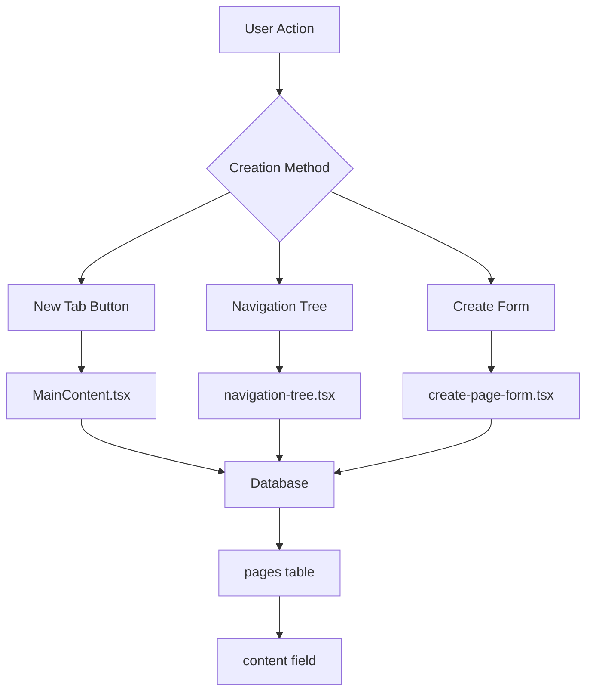
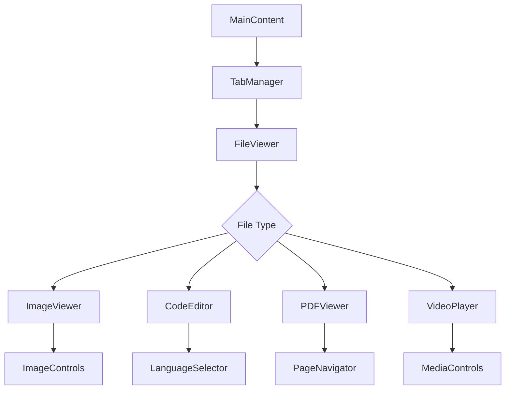

# File Handling Analysis Report

## Table of Contents
1. [Database Structure](#database-structure)
2. [Current Issues](#current-issues)
3. [Component Structure](#component-structure)
4. [File Type Handling](#file-type-handling)
5. [Recommendations](#recommendations)
6. [Current File Flow](#current-file-flow)
7. [Styling Issues](#styling-issues)
8. [Critical Issues to Fix](#critical-issues-to-fix)

## Database Structure

### Current Tables

```sql
-- Main pages table
CREATE TABLE IF NOT EXISTS pages (
  id TEXT PRIMARY KEY,
  chapter_id TEXT NOT NULL,
  title TEXT NOT NULL,
  content TEXT,
  content_text TEXT,
  page_type TEXT DEFAULT 'note',
  tags TEXT,
  position INTEGER,
  metadata TEXT,  -- Added later for file-specific metadata
  created_at DATETIME DEFAULT CURRENT_TIMESTAMP,
  updated_at DATETIME DEFAULT CURRENT_TIMESTAMP,
  FOREIGN KEY (chapter_id) REFERENCES chapters (id) ON DELETE CASCADE
);

-- Separate media files table (currently unused)
CREATE TABLE IF NOT EXISTS media_files (
  id TEXT PRIMARY KEY,
  page_id TEXT,
  filename TEXT NOT NULL,
  file_path TEXT NOT NULL,
  file_type TEXT NOT NULL,
  file_size INTEGER,
  created_at DATETIME DEFAULT CURRENT_TIMESTAMP,
  FOREIGN KEY(page_id) REFERENCES pages(id)
);
```

## Current Issues

### 1. Database Design Issues
- `media_files` table exists but is not being utilized
- All content stored in `pages.content` as text/base64
- No proper separation between different content types
- No optimization for binary data storage
- No proper indexing for efficient queries
- No constraints on file sizes or types

### 2. Page Creation Flow Issues
- Multiple inconsistent creation points:
  - `MainContent.tsx` - "New Tab" button
  - `navigation-tree.tsx` - context menu
  - `create-page-form.tsx` - form dialog
- Inconsistent naming conventions
- Lack of proper file type validation
- No handling for large files
- No proper error handling

### 3. UI/UX Issues
- Loading states not properly managed
- Default naming system needs improvement
- Large file handling missing
- Possible duplicate page creation
- Missing file type validation
- No progress indicators for uploads
- No proper error feedback

### 4. File Type Handling Issues
- All files stored as base64 in page content
- No proper MIME type handling
- Missing file size limits
- Improper binary file handling
- No file extension validation
- No file type-specific optimizations

## Component Structure

// File Type Components:
src/renderer/components/content/
  ├── page-editor.tsx      // Text editor for notes
  ├── code-editor.tsx      // Code editor
  ├── image-viewer.tsx     // Image viewer
  └── MainContent.tsx      // Main container & tab management

// Navigation Components:
src/renderer/components/navigation/
  ├── navigation-tree.tsx  // Tree view of all items
  ├── Sidebar.tsx         // Main sidebar container
  └── account-menu.tsx    // User menu

// Creation Forms:
src/renderer/components/content/
  └── create-page-form.tsx // Page creation dialog

## File Type Handling

### Current Page Interface
```typescript
interface Page {
  id: string
  chapter_id: string
  title: string
  content?: string        // Stores everything as text/base64
  content_text?: string   // Plain text version for search
  page_type?: string     // 'note', 'code', 'image', etc.
  metadata?: {           // Added but inconsistently used
    language?: string
    mimeType?: string
    dimensions?: { width: number, height: number }
    fileSize?: number
    originalFileName?: string
    lastModified?: string
    encoding?: string
    version?: string
  }
  tags?: string
  position?: number
}
```

## Recommendations

### 1. Database Changes Needed
- Properly implement and utilize the `media_files` table
- Add proper indexing for:
  - File types
  - Metadata fields
  - Search optimization
- Implement constraints for:
  - File sizes
  - Allowed file types
  - Required metadata
- Establish proper foreign key relationships
- Add versioning support

### 2. Architecture Changes Needed
- Implement content type separation
- Create dedicated file handling service
- Add validation layer
- Implement proper error handling
- Add file type-specific optimizations
- Implement proper caching strategy

### 3. UI Changes Needed
- Unify page creation workflow
- Improve loading state indicators
- Add proper file validation
- Enhance error handling
- Add file size handling
- Implement progress indicators
- Add drag-and-drop support

### 4. File Type Changes Needed
- Implement MIME type handling
- Add file size restrictions
- Improve binary file handling
- Add file extension validation
- Implement file type-specific features
- Add file conversion support

## Current File Flow



## Styling Issues

### 1. Duplicate Styles
```css
/* Duplicated in multiple places */
.image-viewer { ... }
.code-editor { ... }
```

### 2. Inconsistent Naming
```css
.tab-content vs .tabContent
.page-editor vs .pageEditor
```

### 3. Missing Styles
- Responsive designs for file viewers
- Proper loading states
- Error state styling
- Progress indicators
- Drag-and-drop zones

## Critical Issues to Fix

### 1. Database
- Move binary content to `media_files`
- Add proper constraints and validation
- Implement proper indexing
- Add versioning support
- Optimize queries

### 2. File Creation
- Unify creation workflow
- Add proper validation
- Enhance error handling
- Implement progress tracking
- Add file type verification

### 3. UI/UX
- Fix loading states
- Improve error handling
- Add file type validation
- Implement progress indicators
- Add drag-and-drop support
- Improve naming system

### 4. File Types
- Implement MIME type handling
- Add file size limits
- Improve binary file handling
- Add file extension validation
- Implement type-specific features

## Implementation Plan

### Phase 1: Database Restructuring
1. Create migration for `media_files` implementation
2. Add proper indexes and constraints
3. Implement file metadata handling
4. Add versioning support

### Phase 2: File Handling Service
1. Create dedicated file service
2. Implement file type validation
3. Add file size handling
4. Implement progress tracking
5. Add error handling

### Phase 3: UI/UX Improvements
1. Unify file creation flow
2. Add proper loading states
3. Implement progress indicators
4. Add drag-and-drop support
5. Improve error feedback

### Phase 4: File Type Support
1. Implement MIME type handling
2. Add file size restrictions
3. Improve binary file handling
4. Add file conversion support
5. Implement type-specific features

## Testing Strategy

### 1. Unit Tests
- File type validation
- Size restrictions
- Metadata handling
- Error handling

### 2. Integration Tests
- File creation flow
- Database operations
- UI interactions
- Error scenarios

### 3. End-to-End Tests
- Complete file workflows
- Error handling
- Performance testing
- Load testing

## Performance Considerations

### 1. File Storage
- Implement proper caching
- Optimize binary storage
- Add compression where appropriate
- Implement lazy loading

### 2. Database
- Proper indexing
- Query optimization
- Connection pooling
- Cache implementation

### 3. UI
- Lazy loading of components
- Progressive loading
- Virtual scrolling
- Image optimization

## Security Considerations

### 1. File Validation
- MIME type verification
- File size restrictions
- Content validation
- Malware scanning

### 2. Access Control
- Proper permissions
- File access logging
- Version control
- Audit trail

### 3. Data Protection
- Encryption at rest
- Secure transmission
- Backup strategy
- Recovery procedures

## Additional Considerations

### Current File Type Support Status

#### Image Files
- Current Implementation:
  ```typescript
  // src/renderer/components/content/image-viewer.tsx
  - Stores images as base64 in pages.content
  - No proper size validation
  - No thumbnail generation
  - No image optimization
  - Missing proper drag-and-drop support
  ```

#### Code Files
- Current Implementation:
  ```typescript
  // src/renderer/components/content/code-editor.tsx
  - Basic language support
  - No syntax highlighting
  - No proper file extension handling
  - Missing language-specific features
  ```

#### Future File Types Needed
1. PDF Files
   - Viewer component needed
   - PDF.js integration required
   - Thumbnail generation
   - Page navigation

2. Video Files
   - Custom video player needed
   - Streaming support required
   - Thumbnail generation
   - Format conversion

3. Audio Files
   - Audio player component
   - Waveform visualization
   - Format support

4. CSV/Spreadsheets
   - Table viewer component
   - Data grid implementation
   - Import/Export features

### Electron-Specific Considerations

1. IPC Communication
```typescript
// Current IPC Implementation
// src/main/preload.ts
contextBridge.exposeInMainWorld('electronAPI', {
  createPage: () => ...,
  updatePage: () => ...,
  // Missing proper file handling methods
})

// Needed IPC Methods
interface FileHandlingAPI {
  uploadFile: (file: File) => Promise<string>;
  downloadFile: (fileId: string) => Promise<Buffer>;
  getFileThumbnail: (fileId: string) => Promise<string>;
  validateFile: (file: File) => Promise<boolean>;
}
```

2. File System Integration
```typescript
// Needed File System Handling
interface FileSystemHandler {
  saveFile: (content: Buffer, metadata: FileMetadata) => Promise<string>;
  readFile: (fileId: string) => Promise<Buffer>;
  deleteFile: (fileId: string) => Promise<void>;
  moveFile: (fileId: string, newPath: string) => Promise<void>;
  getFileInfo: (fileId: string) => Promise<FileInfo>;
}
```

### Database Migration Plan

1. Current Schema Issues:
```sql
-- Current issues with pages table
- content field storing mixed data types
- no proper binary data handling
- inefficient storage for large files
- missing proper metadata indexing

-- Needed migrations
ALTER TABLE pages ADD COLUMN file_id TEXT REFERENCES media_files(id);
CREATE INDEX idx_pages_file_type ON pages(page_type);
CREATE INDEX idx_pages_metadata ON pages USING GIN (metadata);
```

2. New Schema Requirements:
```sql
-- New tables needed
CREATE TABLE file_versions (
  id TEXT PRIMARY KEY,
  file_id TEXT REFERENCES media_files(id),
  version_number INTEGER,
  created_at TIMESTAMP,
  metadata JSONB
);

CREATE TABLE file_thumbnails (
  id TEXT PRIMARY KEY,
  file_id TEXT REFERENCES media_files(id),
  size TEXT,
  data BYTEA,
  created_at TIMESTAMP
);
```

### Error Handling Matrix

| Component | Current State | Needed Implementation |
|-----------|--------------|----------------------|
| File Upload | Basic try/catch | Proper validation, retry logic, progress tracking |
| File Type | Basic check | MIME validation, extension verification, content check |
| Size Limits | None | Per-type limits, chunked upload, progress bars |
| Database | Basic errors | Proper error codes, recovery procedures |
| UI Feedback | Minimal | Comprehensive error messages, recovery options |

### State Management Requirements

```typescript
interface FileState {
  uploadProgress: number;
  uploadStatus: 'idle' | 'uploading' | 'processing' | 'complete' | 'error';
  currentOperation: FileOperation | null;
  error: FileError | null;
  metadata: FileMetadata;
}

interface FileOperation {
  type: 'upload' | 'download' | 'process' | 'delete';
  progress: number;
  startTime: Date;
  status: OperationStatus;
}
```

### UI Component Dependencies



### Performance Optimization Strategies

1. File Loading:
```typescript
interface LoadingStrategy {
  // Progressive loading for large files
  loadChunk: (start: number, end: number) => Promise<Buffer>;
  // Preload next chunk
  preloadNext: () => void;
  // Cache management
  cacheChunk: (chunk: Buffer) => void;
}
```

2. Caching Strategy:
```typescript
interface CacheConfig {
  maxSize: number;
  retention: Duration;
  priority: 'lru' | 'fifo' | 'lfu';
}

interface CacheManager {
  store: (key: string, data: any) => void;
  retrieve: (key: string) => any;
  invalidate: (pattern: string) => void;
  cleanup: () => void;
}
```

### File Type Registry

```typescript
interface FileTypeHandler {
  type: string;
  extensions: string[];
  mimeTypes: string[];
  maxSize: number;
  validator: (file: File) => Promise<boolean>;
  processor: (file: File) => Promise<ProcessedFile>;
  viewer: React.ComponentType<ViewerProps>;
}

const fileTypeRegistry: Record<string, FileTypeHandler> = {
  image: {
    type: 'image',
    extensions: ['.png', '.jpg', '.jpeg', '.gif', '.webp'],
    mimeTypes: ['image/*'],
    maxSize: 10 * 1024 * 1024, // 10MB
    validator: validateImage,
    processor: processImage,
    viewer: ImageViewer
  },
  // Add other file types...
}
```

### Testing Scenarios

1. File Upload Tests:
```typescript
describe('File Upload', () => {
  test('handles large files correctly');
  test('validates file types properly');
  test('shows upload progress');
  test('handles network errors');
  test('creates thumbnails');
});
```

2. File Viewer Tests:
```typescript
describe('File Viewers', () => {
  test('loads correct viewer for file type');
  test('handles loading states');
  test('shows error states');
  test('supports file operations');
});
```

### Monitoring and Logging

1. Performance Metrics:
```typescript
interface FileMetrics {
  uploadTime: number;
  processingTime: number;
  loadTime: number;
  errorRate: number;
  cacheHitRate: number;
}
```

2. Error Tracking:
```typescript
interface FileError {
  code: string;
  message: string;
  details: any;
  timestamp: Date;
  context: {
    fileType: string;
    operation: string;
    size: number;
  };
}
```

This additional information provides more context and specific implementation details that will be crucial for fixing the current issues and implementing proper file handling. Would you like me to add any other specific sections or elaborate on any particular area?